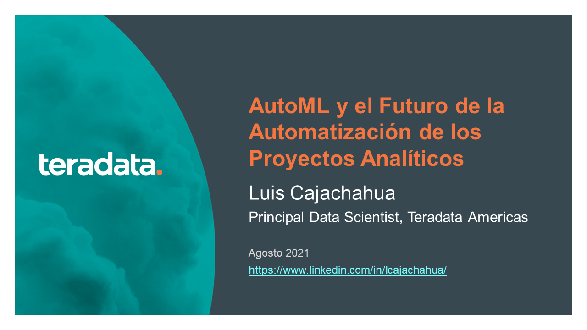

# Webinar StartupUNI: AutoML y el Futuro de la Automatización de los Proyectos Analíticos

Materiales del Webinar del 17-Ago-2021

Puedes descargar la presentación haciendo clic derecho y eligiendo la opción "Descargar Como.." en este [ENLACE](docs/Futuro_AutoML.pdf)

Y desde aquí puedes acceder a la [grabación](https://www.facebook.com/startupunioficial/) en Facebook:

## Referencias

La presentación ha sido desarrollada teniendo en cuenta los siguientes artículos.

1. [AutoML - The Future of AI](https://www.slideshare.net/NingJiang8/automl-the-future-of-ai)

2. [The Past, Present and Future of Automated Machine Learning (AutoML)](https://www.youtube.com/watch?v=RsIU-bx_9SE)

3. [Demo de Google AutoML Tables en Espanol](https://www.youtube.com/watch?v=YnfljmYm3pE)

4. [Auto machine learning (AutoML)](https://www.youtube.com/watch?v=V5BYitgLbhc)

5. [AutoML (Machine Learning para Vagos) - PyConES 2020](https://www.youtube.com/watch?v=1gLM-cM_XJ8)

6. (Introduction to H20 AutoML with Python](https://www.youtube.com/watch?v=EUNHDIzSt8Q)

7. [Introduction to H2O Driverless AI by Marios Michailidis](https://www.youtube.com/watch?v=GMtgT-3hENY)

8. [AutoML - Paco Nathan | PyData Hamburg May 2021](https://www.youtube.com/watch?v=7oW49Ulr4cY)

9. [AutoML Showdown: Google vs Amazon vs Microsoft](https://www.youtube.com/watch?v=qiDrD8omVVg)

10. [An Open Source AutoML Benchmark](https://arxiv.org/pdf/1907.00909.pdf)

11. [Google PAIR - Chapters](https://pair.withgoogle.com/guidebook/chapters)

12. [Google’s AI Experts Try to Automate Themselves](https://www.wired.com/story/googles-ai-experts-try-automate-themselves/)

13. [It’s Managers, Not Workers, Who Are Losing Jobs To AI And Robots, Study Shows](https://www.forbes.com/sites/joemckendrick/2020/11/15/its-managers-not-workers-who-are-losing-jobs-to-ai-and-robots-study-shows/?sh=2e5142cb20d5)

14. [OpenAI can translate English into code with its new machine learning software Codex](https://www.theverge.com/2021/8/10/22618128/openai-codex-natural-language-into-code-api-beta-access)

15. [Why the year 2020 will prove to be a headache for Data Scientists](https://towardsdatascience.com/why-the-year-2020-will-prove-to-be-a-headache-for-data-scientists-5ff1f15f3cd3)

16. [The Recession’s Impact on Analytics and Data Science](https://sloanreview.mit.edu/article/the-recessions-impact-on-analytics-and-data-science/)

17. [Data Science, Quarantined](https://sloanreview.mit.edu/article/data-science-quarantined/)

18. [Google is developing a new superintelligent AI but ethical questions remain](https://finance.yahoo.com/news/google-developing-superintelligent-ai-ethical-080145831.html)

19. [Kite VS. TabNine: Which AI Code Autocomplete Should You Choose?](https://medium.com/swlh/kite-vs-tabnine-which-ai-code-autocomplete-should-you-choose-eb6eba85c3a6)
